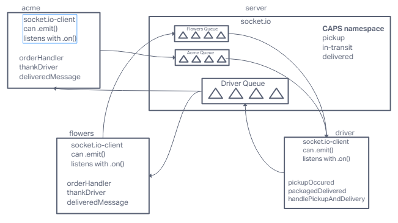

# LAB - 11 / 12 / 13

## Project: CAPS

### Authors: Ike Steoger

### Problem Domain

Application for a product called CAPS - The Code Academy Parcel Service. CAPS will simulate a delivery service where vendors (such a flower shops) will ship products using our delivery service and when our drivers deliver them, each vendor will be notified that their customers received what they purchased. First built with EventEmitters and then transfered to Socket.io functionality. Also added functionality to queue events & emit them when connection is made.

### Links and Resources

- [GitHub Actions ci/cd](https://github.com/IkeSteoger/caps/actions)
<!-- - [back-end dev server url]() -->
<!-- - [back-end prod server url]() -->

### Collaborators

Kaeden O'maera  
Josh Coffey  
Reece Renninger  
Ryan Gallaway  

### Setup

#### How to initialize/run your application

Clone repo, `npm i`, alter `.env` file, `npm start`.

#### Tests

To run tests, after running `npm i`, run the command `npm test`

#### UML - Lab 13

#### UML - Lab 12

#### UML - Lab 11

